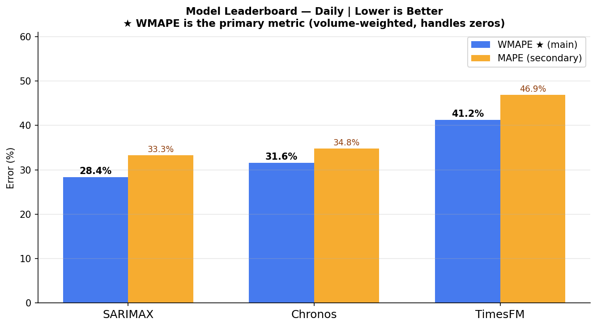
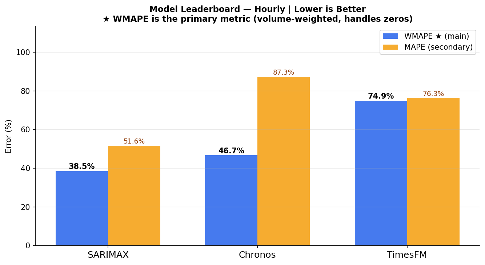
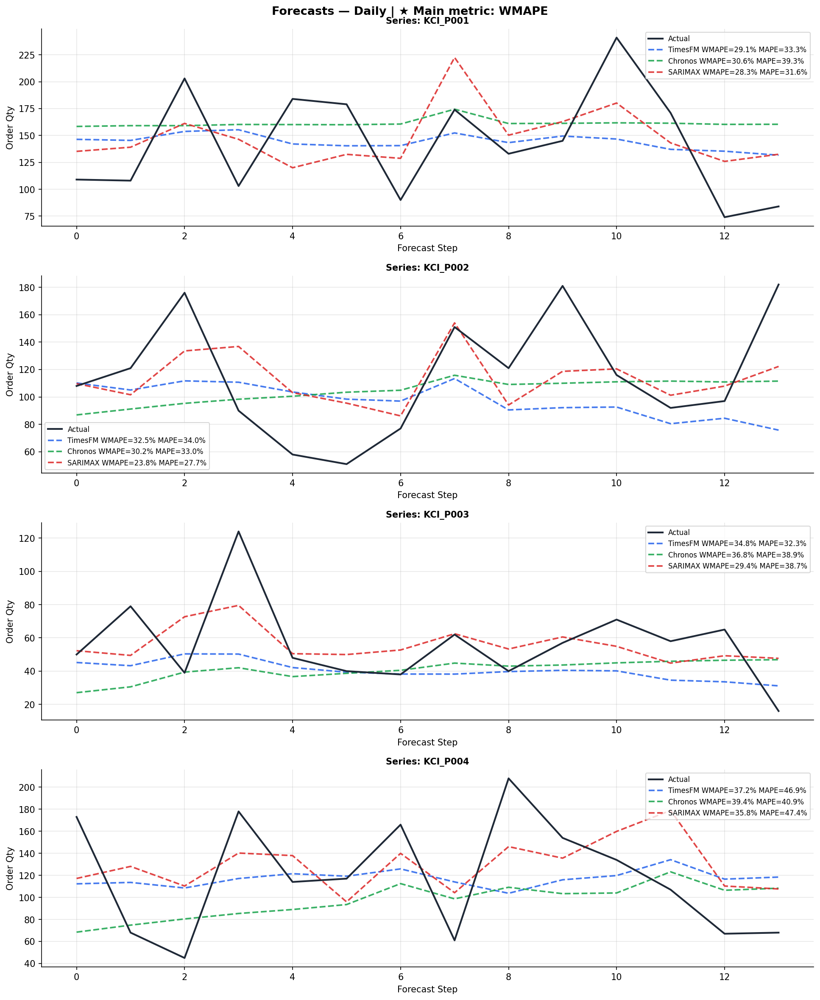
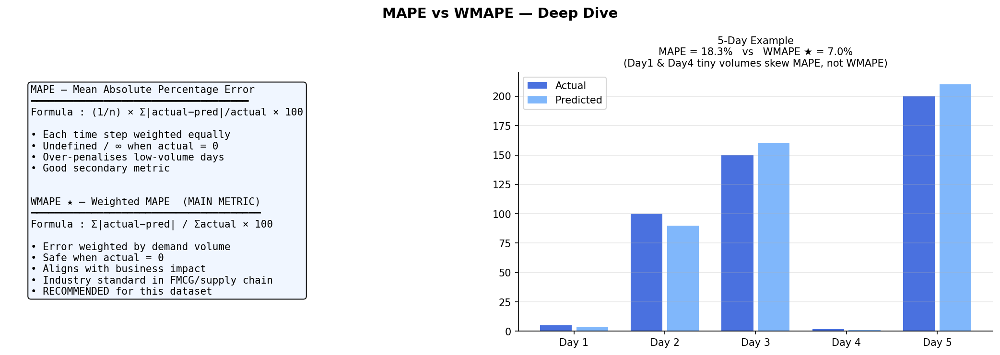

# TimesFM & Chronos Forecasting 

Multi-product demand forecasting system using foundation time-series models, covariates, and business forecasting metrics.

---

# Project Overview

This project implements an end-to-end time series forecasting pipeline for predicting future product demand using:

- TimesFM (Google Foundation Time-Series Model)
- Chronos (Amazon Forecasting Foundation Model)
- SARIMAX baseline model
- Covariates / external features
- Daily and Hourly forecasting
- MAPE and WMAPE evaluation metrics

The system forecasts future order quantities for multiple products and compares model performance using business-oriented metrics.

---

# Features

✔ Multi-product forecasting  
✔ Daily forecasting pipeline  
✔ Hourly forecasting pipeline  
✔ TimesFM forecasting workflow  
✔ Chronos forecasting workflow  
✔ SARIMAX statistical baseline  
✔ Covariate-based forecasting  
✔ Automated feature engineering  
✔ WMAPE & MAPE evaluation  
✔ Forecast visualizations  
✔ Automated Excel reporting  

---

# Models Used

| Model | Description |
|---|---|
| TimesFM | Google transformer-based foundation forecasting model |
| Chronos | Amazon transformer-based probabilistic forecasting model |
| SARIMAX | Statistical forecasting baseline using lag features |

---

# Dataset

Dataset contains:

- Multi-product order history
- Daily order data
- Hourly order data
- Promotion information
- Holiday information
- Weather features
- Pricing information

---

# Covariates Used

| Covariate | Purpose |
|---|---|
| promotion | Promotion impact |
| holiday | Holiday demand spike |
| is_weekend | Weekend demand |
| temperature_c | Weather effect |
| rainfall_mm | Rain impact |
| price | Pricing effect |
| day_of_week | Weekly seasonality |
| month | Monthly seasonality |
| hour | Intraday patterns |

---

# Forecasting Levels

## Daily Forecasting

Captures:

- Weekly seasonality
- Monthly trends
- Promotion effects
- Long-term demand patterns

Forecast Horizon:
- 14 days

---

## Hourly Forecasting

Captures:

- Intraday demand
- Peak business hours
- Evening traffic
- Hour-level seasonality

Forecast Horizon:
- 24 hours

---

# Time Series Pipeline

```text
Raw Data
   ↓
Data Cleaning
   ↓
Feature Engineering
   ↓
Create Time Series
   ↓
Train/Test Split
   ↓
TimesFM / Chronos / SARIMAX
   ↓
Forecast Generation
   ↓
MAPE + WMAPE Evaluation
   ↓
Visualization + Excel Reports
````

---

# Input to Forecasting Models

The models receive:

## Historical Context Window

Example:

```python
[120, 130, 125, 140, 150]
```

## Covariates

```python
promotion
holiday
temperature_c
rainfall_mm
is_weekend
```

---

# Main Evaluation Metric

# WMAPE (Primary Metric)

```text
WMAPE = Σ|actual - predicted| / Σactual × 100
```

Why WMAPE?

* Volume weighted
* Stable with zero demand
* Industry standard
* Better business metric
* Preferred in supply-chain forecasting

---

# Secondary Metrics

## MAPE

```text
MAPE = Mean(|actual - predicted| / actual) × 100
```

## MAE

Mean Absolute Error

## RMSE

Root Mean Squared Error

---

# TimesFM Explanation

TimesFM is a transformer-based foundation model developed by Google for time-series forecasting.

It learns:

* Trend
* Seasonality
* Long-term dependencies
* Multi-series patterns

Context window:

* Daily → 90 steps
* Hourly → 48 steps

---

# Chronos Explanation

Chronos is Amazon’s forecasting foundation model built on T5 transformer architecture.

Key features:

* Probabilistic forecasting
* Multi-sample prediction
* Sequence tokenization
* Median forecast generation

---

# SARIMAX Baseline

Implemented statistical baseline using:

* Lag features
* Rolling averages
* Covariates
* Seasonal patterns

Features:

* lag_7
* lag_14
* rolling_mean

---

# Feature Engineering

## Calendar Features

```python
day_of_week
month
hour
```

## Cyclical Encoding

```python
dow_sin
dow_cos
month_sin
month_cos
```

Purpose:

* Helps model learn periodic patterns

---

# Project Structure

```text
timesfm-chronos-forecasting-pipeline/
│
├── data/
│   └── complex_multi_product_order_forecasting_dataset.xlsx
│
├── outputs/
│   ├── forecasts_daily.png
│   ├── forecasts_hourly.png
│   ├── leaderboard_daily.png
│   ├── leaderboard_hourly.png
│   ├── metrics_explained.png
│   └── timeseries_forecasting_report.xlsx
│
├── timeseries_forecasting.py
│
├── README.md
├── requirements.txt
├── .gitignore
└── LICENSE
```

---

# Installation

Clone repository:

```bash
git clone https://github.com/Chintan1545/timesfm-chronos-forecasting.git
```

Move into project:

```bash
cd timesfm-chronos-forecasting
```

Install dependencies:

```bash
pip install -r requirements.txt
```

---

# Run Project

```bash
python timeseries_forecasting.py
```

---

# Outputs Generated

The pipeline generates:

* Forecast plots
* Leaderboard charts
* Metrics visualization
* Excel forecasting report

---

## Results

### Model Leaderboard — Daily


### Model Leaderboard — Hourly


### Forecast Visualization — Daily


### Metrics Explained


---

# Example Outputs

## Forecast Visualization

* Daily forecasts
* Hourly forecasts
* Actual vs predicted comparison

## Model Leaderboard

Comparison using:

* WMAPE
* MAPE
* MAE
* RMSE

---

# Business Use Cases

* Retail demand forecasting
* FMCG forecasting
* Inventory optimization
* Supply chain planning
* Promotion planning
* Warehouse forecasting

---

# Future Improvements

* Real pretrained TimesFM integration
* Real Chronos API integration
* Hyperparameter tuning
* Cross-validation
* Ensemble forecasting
* Real-time inference
* Deployment on Vertex AI / SageMaker

---

# Tech Stack

| Component          | Technology       |
| ------------------ | ---------------- |
| Language           | Python           |
| Data Processing    | Pandas, NumPy    |
| ML Models          | TimesFM, Chronos |
| Statistical Models | SARIMAX          |
| Visualization      | Matplotlib       |
| Reporting          | OpenPyXL         |
| Metrics            | WMAPE, MAPE      |

---

# Author

## Chintan Dabhi

AI/ML Engineer | Time-Series Forecasting | Deep Learning 

GitHub: [https://github.com/Chintan1545](https://github.com/Chintan1545)

LinkedIn: [https://www.linkedin.com/in/chintan-dabhi-4b3351356/](https://www.linkedin.com/in/chintan-dabhi-4b3351356/)

---

# License

This project is for educational and research purposes.

```
MIT
```
